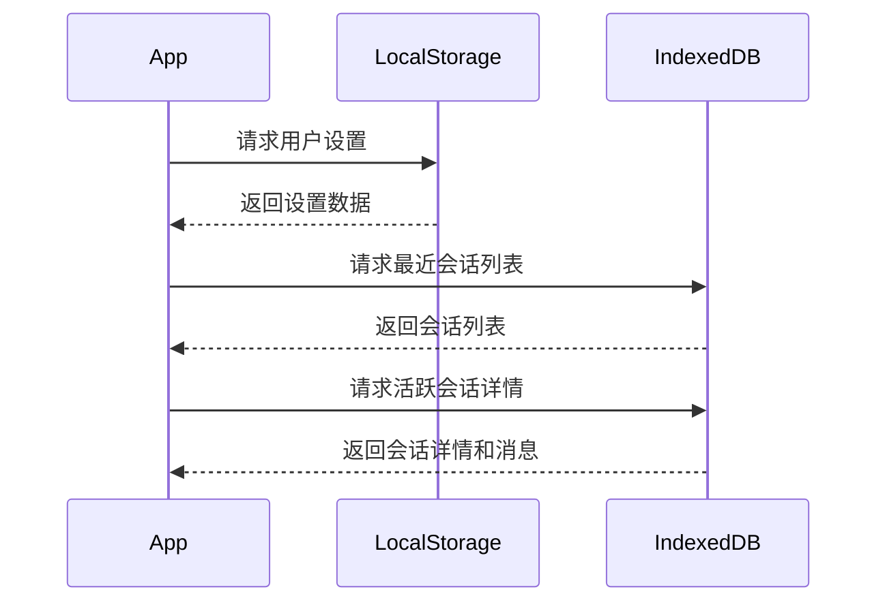
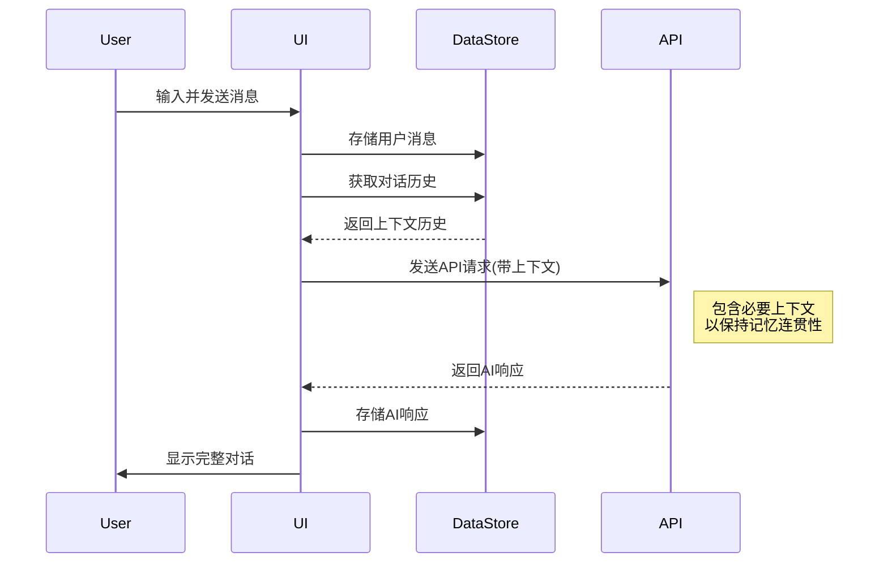
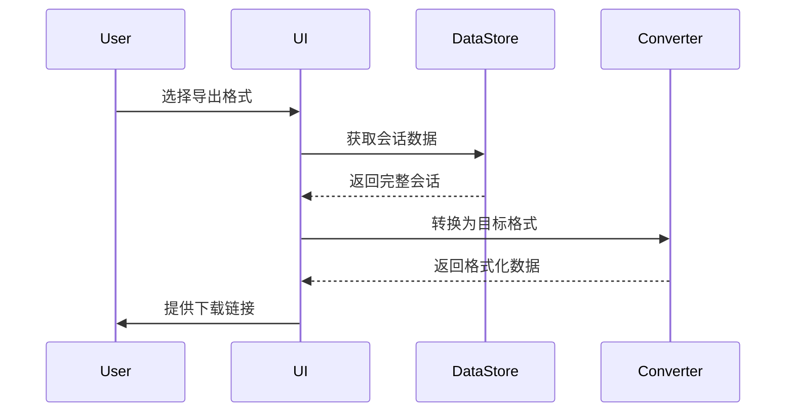

# ChatGPT式对话应用数据流设计

## 数据模型

### 用户设置
```typescript
interface APISettings {
  apiKey: string;          // OpenAI API密钥
  model: string;           // 使用的模型，如"gpt-4"
  temperature: number;     // 温度参数（0-1）
  maxTokens: number;       // 最大输出token数
  systemPrompt: string;    // 系统提示词
}

interface AppSettings {
  theme: 'light' | 'dark' | 'system';
  fontSize: 'small' | 'medium' | 'large';
  messageDisplayDensity: 'compact' | 'comfortable';
  enableSounds: boolean;
  autoSaveInterval: number; // 自动保存间隔（分钟）
}
```

### 对话数据
```typescript
interface Conversation {
  id: string;              // 唯一标识符
  title: string;           // 会话标题
  createdAt: number;       // 创建时间戳
  updatedAt: number;       // 最后更新时间戳
  messages: Message[];     // 消息数组
}

interface Message {
  id: string;              // 唯一标识符
  role: 'user' | 'assistant' | 'system'; // 消息发送者角色
  content: string;         // 消息内容
  timestamp: number;       // 时间戳
  status: 'sending' | 'sent' | 'error'; // 消息状态
  error?: string;          // 错误信息（如果有）
}

interface ClipboardItem {
  id: string;              // 唯一标识符
  content: string;         // 内容
  createdAt: number;       // 创建时间
  source: {                // 来源信息
    conversationId: string;
    messageId: string;
  };
}
```

## 数据存储方案

### localStorage 用途
用于存储小型、非敏感的配置数据：
- 用户界面偏好（主题、字体大小等）
- 加密后的API设置
- 最近使用的会话ID
- 应用状态

**示例：**
```javascript
// 存储设置
localStorage.setItem('appSettings', JSON.stringify(appSettings));

// 加密存储API密钥
const encryptedApiKey = encryptData(apiKey, userPassphrase);
localStorage.setItem('apiSettings', JSON.stringify({
  ...apiSettings,
  apiKey: encryptedApiKey
}));
```

### IndexedDB 用途
用于存储大量结构化数据：
- 完整的对话历史记录
- 消息内容
- 用户的剪贴板内容

**数据库结构：**
```
ChatDB (数据库名)
├── conversations (对象存储)
│   └── 索引：
│       ├── id (主键)
│       ├── title
│       └── updatedAt
├── messages (对象存储)
│   └── 索引：
│       ├── id (主键)
│       ├── conversationId
│       └── timestamp
└── clipboard (对象存储)
    └── 索引：
        ├── id (主键)
        └── createdAt
```

## 数据流动路径

### 初始化流程
1. 应用启动
2. 从localStorage加载基本设置和UI偏好
3. 从IndexedDB加载最近会话列表
4. 如果有上次打开的会话，加载该会话详情
5. 初始化UI状态



### 用户发送消息流程
1. 用户输入消息并提交
2. 在UI立即显示用户消息
3. 将用户消息保存到IndexedDB
4. 组装上下文（包含历史消息）
5. 调用OpenAI API
6. 接收AI响应
7. 在UI显示AI响应
8. 将AI响应保存到IndexedDB
9. 更新会话元数据



### 导出内容流程
1. 用户选择导出格式（Markdown/PDF/Word）
2. 从IndexedDB加载完整会话内容
3. 根据选择的格式转换数据
4. 生成文件并提供下载



## 数据持久化策略

### 自动保存
- 用户发送/接收消息后自动保存
- 定期自动保存编辑中的内容
- 应用状态变化时保存（如切换会话）

### 冲突处理
- 使用时间戳检测数据版本
- 在多标签页场景下提供冲突解决机制
- 本地存储优先级高于远程数据（无服务端场景）

### 数据清理
- 提供手动清理过期数据的选项
- 可配置自动清理阈值（如保留最近30天对话）
- 在存储空间不足时提示用户清理数据

## 安全考虑

### API密钥存储
- 使用密码派生加密算法保护API密钥
- 存储加密后的API密钥
- 仅在内存中短暂保存解密后的密钥

### 本地数据保护
- 提供导出加密备份选项
- 可选的会话密码保护
- 明确的隐私政策和数据使用说明
